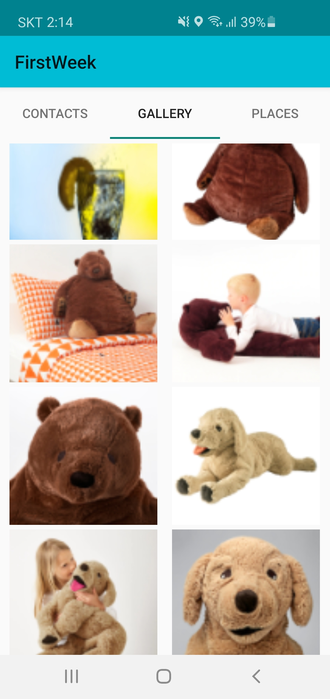

# 안드로이드 생활 어플리케이션 (Serverless)

![language-java][language-java]
![platform-android][platform-android]
 
![participants-duo][participants-duo]
 
[![institution-kaist][kaist-image]][kaist-cs-url]
[![course-immersion-camp][course-cs496]][course-cs496-url]
![grade-p][grade-p]

> 로컬 연락처와 사진의 추가, 수정, 삭제 기능을 제공하고 내 주변 반경 500m 이내의 맛집 정보를 구글 지도에 핀으로 표시해서 보여주는 어플리케이션입니다.

### 스크린샷

### 개발 기간

2019년 6월 25일 - 7월 2일 (7일간)

### 구현 사항

  * 탭 1: RecyclerView를 이용하여 로컬 연락처를 표시, 연락처 추가, 수정, 삭제 기능을 지원
  * 탭 2: RecyclerView를 이용하여 로컬 사진을 표시, 사진 추가, 수정, 삭제 기능을 지원
  * 탭 3: Google Maps Places API를 이용하여 내 위치 주변의 맛집정보를 지도에 표시하여 제공

### 라이선스 및 공동체 수정

이곳은 개인 프로젝트 백업을 목적으로 하는 저장소입니다.

  * 모든 제3자 사용을 허가하지 않습니다.
  * 모든 제3자 수정을 승인하지 않습니다.
    * 깃허브 Pull Request를 받지 않습니다.

<!-- Image definitions -->
[kaist-image]: https://img.shields.io/badge/Institution-KAIST-blue
[kaist-cs-url]: https://cs.kaist.ac.kr
[course-cs496]: https://img.shields.io/badge/Course-Immersion%20Camp-brightgreen
[course-cs496-url]: https://madcamp.io
[language-java]: https://img.shields.io/badge/Language-Java-orange
[platform-android]: https://img.shields.io/badge/Platform-Android-yellowgreen
[grade-p]: https://img.shields.io/badge/Grade-P-yellow
[participants-duo]: https://img.shields.io/badge/Participants-Duo%20Project-7aa3cc
